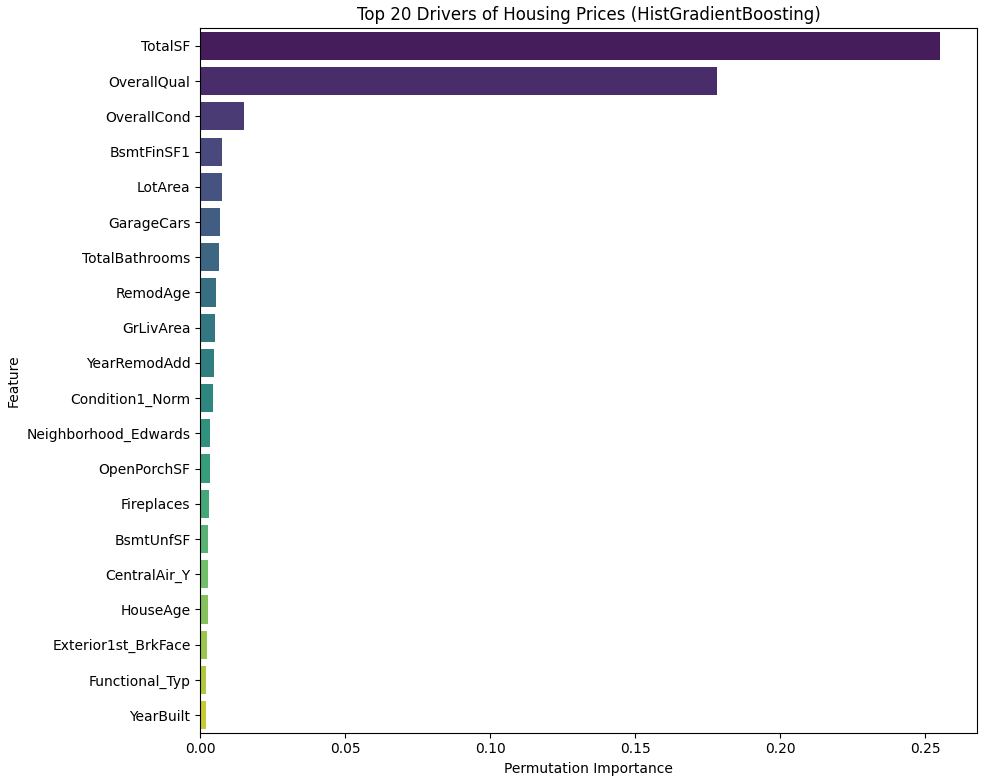
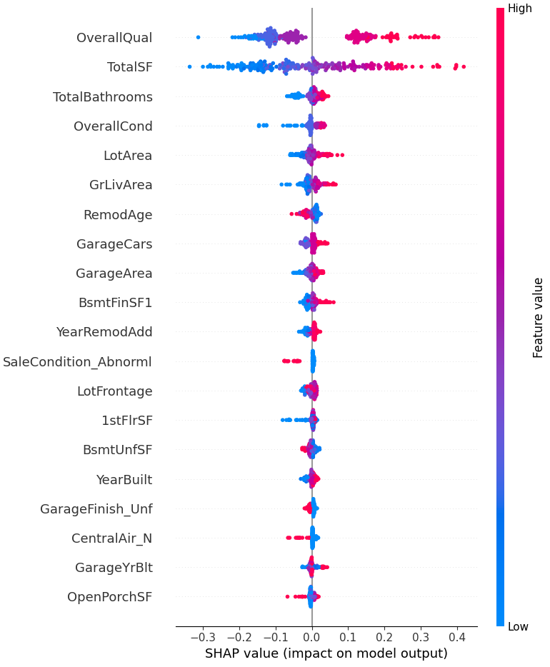
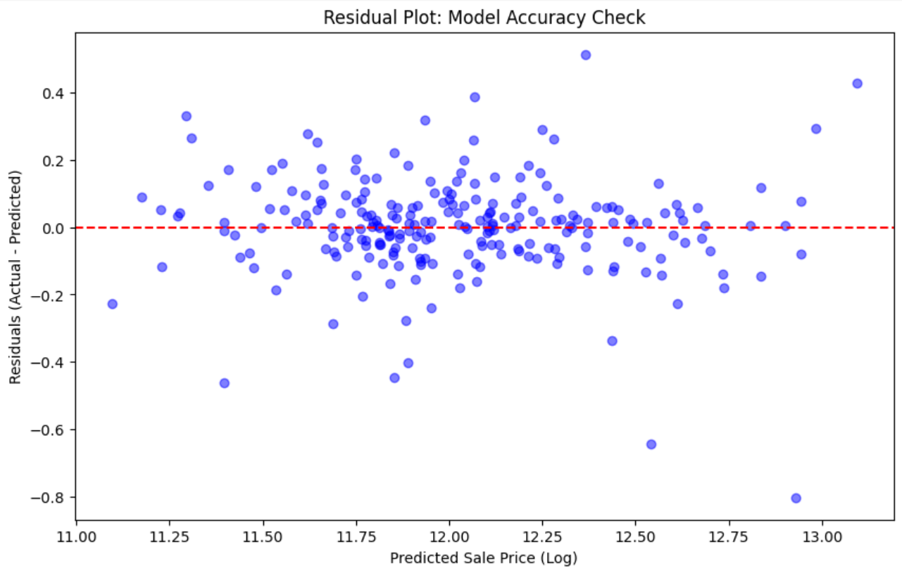

# 🏡 Housing Price Prediction Pipeline

## 📌 Problem Statement
The goal of this project is to build a production-grade machine learning regression pipeline to predict residential property values (SalePrice). Moving beyond basic analysis, this project emphasizes strict software engineering principles: preventing data leakage, automating preprocessing workflows via Scikit-Learn `Pipeline` objects, and utilizing Explainable AI (SHAP) to provide transparent, data-driven real estate valuations.

## 📊 Dataset Information
* **Source:** Residential Housing Dataset 
* **Target Variable:** `SalePrice` (Log-transformed for normalized distribution)
* **Key Features:** Overall Quality, Lot Frontage, Year Built, Remodel Dates, Basement Square Footage, and Above-Grade Living Area.
  
## 🛠️ Tools & Technologies Used
* **Programming Language:** Python
* **Data Manipulation:** `pandas`, `numpy`
* **Machine Learning:** `scikit-learn` (HistGradientBoosting, Random Forest, Ridge, Lasso, GridSearchCV)
* **Explainable AI (XAI):** `shap`, `permutation_importance`
* **Data Visualization:** `matplotlib`, `seaborn`

## ⚙️ Steps Performed
1. **Data Leakage Prevention:** Executed strict `train_test_split` prior to any imputation or feature engineering, ensuring the test set remained completely unseen and evaluation metrics were perfectly honest.
2. **Feature Engineering:** * Formulated high-signal derived metrics: `HouseAge`, `RemodAge`, `TotalBathrooms`, and `TotalSF` (Total Square Footage).
   * Applied a `log1p` transformation to the target variable (`SalePrice`) to handle severe right-skewness and outliers in luxury homes.
3. **Automated Preprocessing:** Constructed a robust `ColumnTransformer` pipeline.
   * *Numerical:* Handled missing data via median imputation and scaled features using `StandardScaler`.
   * *Categorical:* Handled missing data via constant imputation ("None") and applied `OneHotEncoder` (with `handle_unknown='ignore'` and `sparse_output=False` to ensure stability in production).
4. **Model Bake-Off & Tuning:** Evaluated multiple baseline algorithms (Linear vs. Tree-based). Scaled the data to provide a fair comparison, and aggressively tuned the top performers using `RandomizedSearchCV`.

## 🏆 Key Insights & Results
The **HistGradientBoostingRegressor** emerged as the undisputed best-performing model. By leveraging binning techniques, it expertly captured non-linear relationships and handled complex housing outliers far better than standard linear models.

**Business Takeaways:**
* **Size and Quality Dictate Price:** `TotalSF` (Total Square Footage) and `OverallQual` (Overall Material and Finish Quality) are the overwhelmingly dominant drivers of property value in this market. 
* **Buyers Pay for the Finish:** While size sets the baseline price, the massive importance of `OverallQual` proves that renovations and high-quality materials are the primary way to push a property into a premium price tier.
* **Algorithmic Efficiency:** Because our baseline parameters for HistGradientBoosting (`max_iter=100`, `learning_rate=0.1`) hit the predictive ceiling of the current dataset, it proved that the model had successfully extracted all available signal without requiring mathematically exhaustive hyperparameter tuning.

## 📸 Screenshots & Visualizations

### 1. Top Drivers of Housing Prices

*Permutation Importance graph highlighting the top 20 features driving real estate values, proving that Size (TotalSF) and Quality (OverallQual) lead the market.*

### 2. Explainable AI (SHAP Values)

*SHAP Summary Plot illustrating how each specific feature pushes the final predicted price higher (red) or lower (blue).*

### 3. Model Accuracy (Residual Plot)

*Residual plot analyzing the distribution of errors (Actual vs. Predicted prices) for the final HistGradientBoosting model, ensuring no major heteroscedasticity.*
